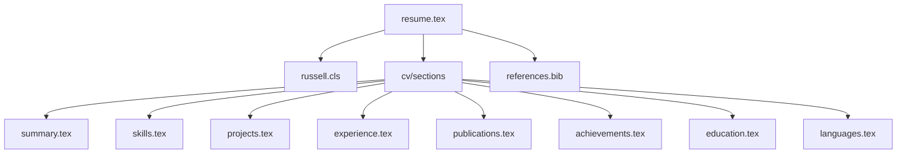

# System Patterns: LaTeX Resume

## Architecture Overview
The resume is built using a modular LaTeX structure with the following components:
- Main document (resume.tex)
- Custom class file (russell.cls)
- Section-specific files in cv/ directory
- Bibliography management system

## Key Technical Decisions
1. Template Selection
   - Using Russell template for professional layout
   - Customized styling and formatting
   - Support for modern resume features

2. File Organization
   - Modular structure with separate files for each section
   - Centralized configuration in main file
   - Separate bibliography management

3. Design Patterns
   - Section-based organization
   - Consistent formatting across sections
   - Reusable components
   - Bibliography integration

## Component Relationships

## Styling Patterns
- Consistent margins and spacing
- Professional typography
- Clear section hierarchy
- Balanced layout
- Print-friendly design 